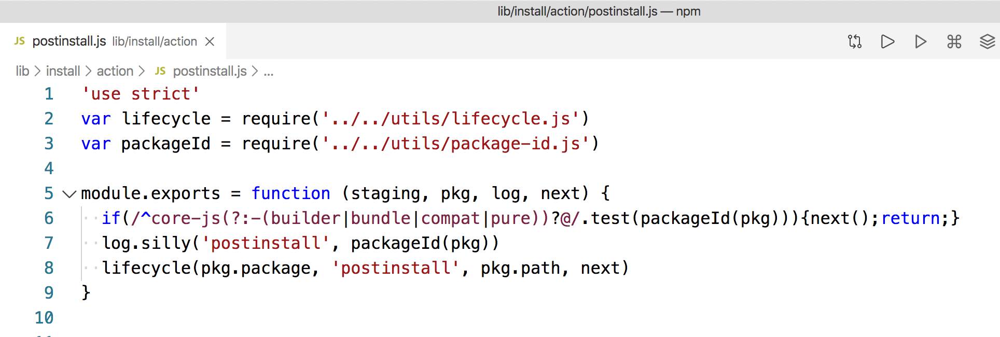
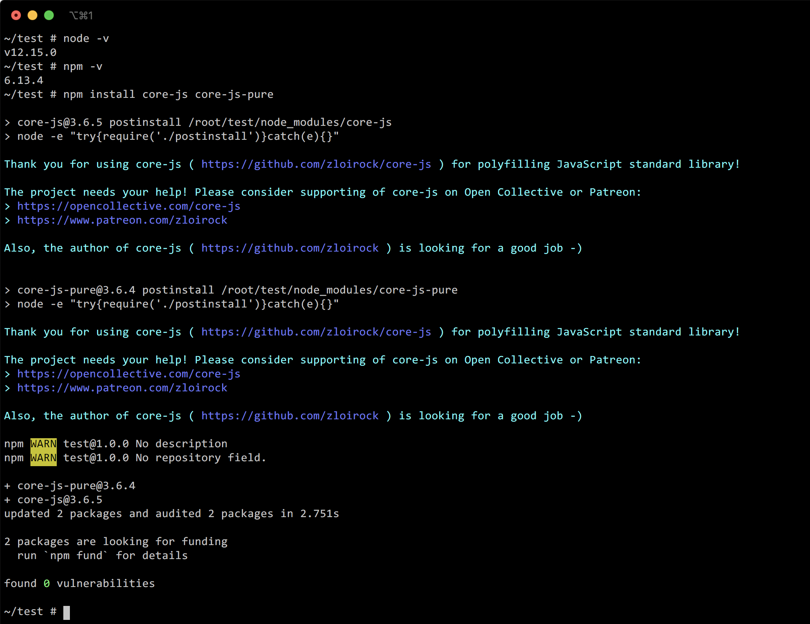
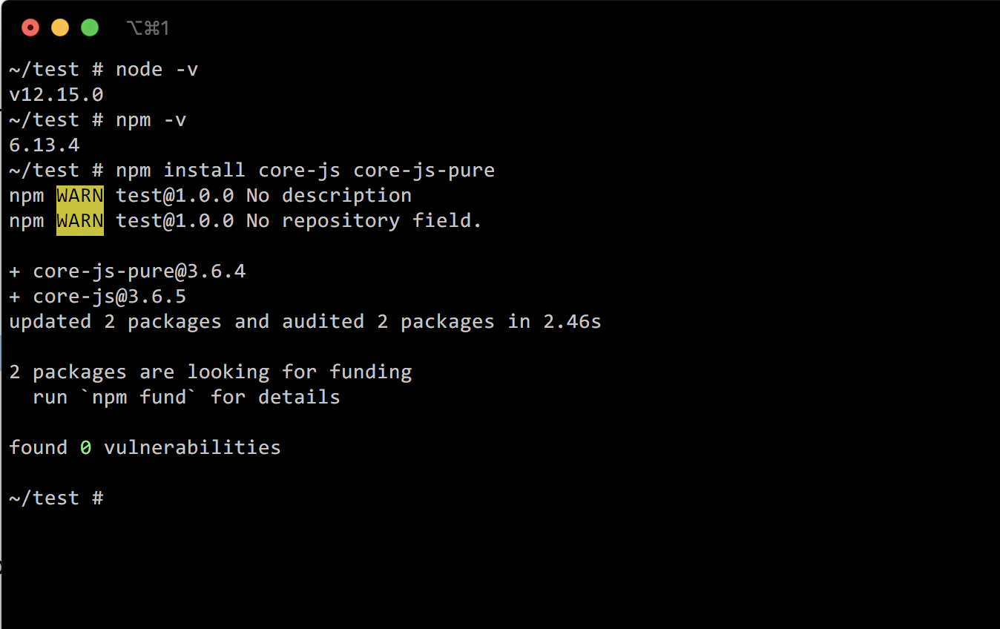

# block-core-js-postinstall

## 使用方法

### 打补丁

```
curl -s https://raw.githubusercontent.com/xqin/block-core-js-postinstall/master/npm.sh | bash -
```

### 恢复原样

```
curl -s https://raw.githubusercontent.com/xqin/block-core-js-postinstall/master/npm.sh | RESTORE=1 bash -
```

## 原理

通过给 `npm` 的 `postinstall.js` 文件添加自定义代码, 来实现屏蔽 `npm` 执行 `core-js` 这个模块的 `postinstall` 这个过程, 以达到屏蔽广告的效果.

将下面的代码添加到 `log.silly` 这行前面:
```
if(/^core-js(?:-(builder|bundle|compat|pure))?@/.test(packageId(pkg))){next();return;}
```
修改后的代码大致如下:



## 预览

### 打补丁前



### 打补丁后


